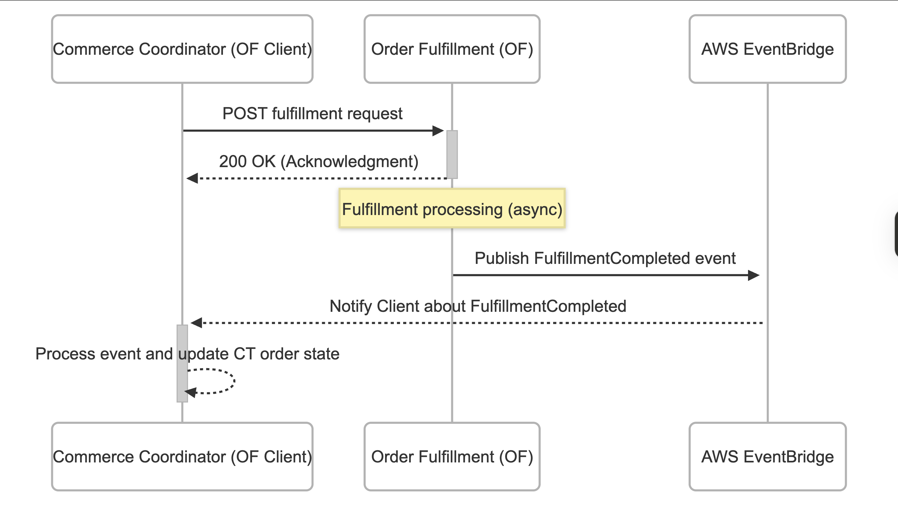

################################################
Webhook-Based Fulfillment Service Communication
################################################

Status
******

**Approved**

Context
*******

We are designing a new fulfillment engine as a Django-based service (Order Fulfillment, or OF) to process fulfillment (e.g., fulfilling in LMS) requests initiated by its client -- the Commerce Coordinator (CC) service. These services will be maintained by different organizations — OF by 2U, and CC by Red Ventures.

To maintain clear service boundaries, we need a secure and reliable communication model.

This ADR documents the implementation approaches considered and the rationale for choosing a synchronous API call from Commerce Coordinator to Order Fulfillment for initiating fulfillment requests. And on fulfillment completion, the Order Fulfillment service will use AWS EventBridge to publish fulfillment completion events to notify subscribed clients (CC).

Decision: API for Fulfillment Requests (CC->OF), AWS EventBridge for Fulfillment Completion (OF->CC)
****************************************************************************************************

We will use a synchronous API call from CC to OF to submit fulfillment requests, and AWS EventBridge to asynchronously notify CC when fulfillment is complete.

Architecture
============

- **CC → OF (Request via API)**

CC will call a REST API exposed by OF to request fulfillment.

This is a simple, synchronous HTTP request with a JSON body.

- **OF → CC (Response via EventBridge)**

Once fulfillment is complete (immediately or after some async process), OF will publish a message to a custom EventBridge event bus.

CC will subscribe to these events and handle fulfillment responses to update internal state (e.g., mark orders as fulfilled).

Pros
====

- **Alignment with Standard Service Design**: Services should expose APIs for direct action and use event buses for publishing state changes.
- **Future-Proofing**: OF can now serve any client, not just CC. Clients issue instructions via API; OF issues events regardless of who the client is.
- **Built-in Retry and Delivery Guarantees (via EventBridge)**: Ensures fulfillment completion notifications are reliably delivered.
- **Simplified Client Logic**: CC can easily call the OF API and receive an acknowledgment before listening asynchronously for the result.
- **Operational Separation**: Each service focuses on its primary responsibilities: CC initiates actions, OF performs them and emits results.
- **Secure Communication**: The synchronous API call from CC to OF can be authenticated using OAuth or signed headers, while EventBridge provides built-in encryption and IAM-based access control to ensure only authorized services can publish or consume events.

Rejected Alternatives
*********************

1. Open edX Kafka Event Bus
===========================

- **Coupling to 2U Infrastructure**: The Kafka bus is managed through `edx-terraform` under 2U ownership, introducing infra and org-level dependencies.
- **Tied to Open edX Events**: Requires all events to be defined in the `openedx-events` repo, adding further tight coupling.
- **Dependent on OpenEdxPublicSignals**: Built around `OpenEdxPublicSignals`, which assumes deeper integration into Open edX internals.
- **Django-Specific**: Primarily designed for Django-based services, which is limiting since future consumers may not use Django.

The strong dependency on Open edX and Django conflicts with our architectural goals of service independence and platform neutrality. Thus, we ruled this option out.

**References**

- `How to start using the Event Bus (Open edX) <https://openedx.atlassian.net/wiki/spaces/AC/pages/3508699151/How+to+start+using+the+Event+Bus>`_
- `How to Use the Event Bus on edX.org (2U) <https://2u-internal.atlassian.net/wiki/spaces/AT/pages/174555142/How+to+Use+the+Event+Bus+edX.org+2+of+2>`_

2. AWS EventBridge for Both Directions
======================================

- **Unnecessary Complexity for CC → OF (Request)**: Using AWS EventBridge for the request from CC to OF introduces unnecessary complexity, as EventBridge is more suited for asynchronous event-based communication, not direct synchronous requests.
- **Not Aligned with Event-Based Semantics**: Event-based systems typically involve publishing events to notify state changes, not instructing another service on what to do. Using EventBridge to send direct requests contradicts this pattern and adds unnecessary overhead.

3. Third-Party Webhook Libraries
================================

- **Lack of Cross-Platform Support**: No single library works natively across all major languages like Python, Node.js, etc.
- **Minimal Value Add**: HMAC signing and timestamp checks are simple to implement with native modules (`hmac`, `hashlib`, `crypto`, etc.).
- **Maintenance Risk**: Reliance on third-party maintainers with uncertain support or updates.
- **Reduced Flexibility**: Custom behavior or advanced integrations may be harder to achieve.
- **Learning Overhead**: Each library adds new abstractions that need to be understood and tested.

While these libraries provide basic utilities like signature verification, they do not offer enough value beyond what native modules can accomplish. Considering the simplicity of our use case and need for full control, we opted against introducing external dependencies.

4. Fully Custom Webhook Model (Bidirectional)
=============================================

- **Custom Retry Logic and Failure Handling**: Implementing retry logic and failure handling from scratch adds complexity to the system. Handling edge cases and ensuring robust delivery can be error-prone and time-consuming.
- **Scalability Issues**: As the number of upstream clients increases, the custom webhook model may struggle to scale efficiently, leading to performance bottlenecks or maintenance challenges.
- **Increased Development and Maintenance Effort**: Building and maintaining a fully custom solution requires ongoing effort for testing, monitoring, and updating the webhook system, adding long-term technical debt.
